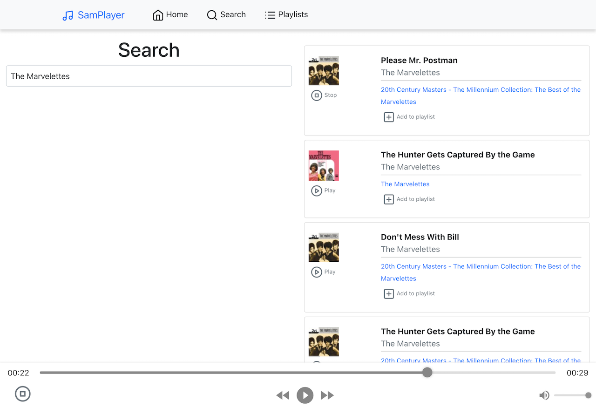
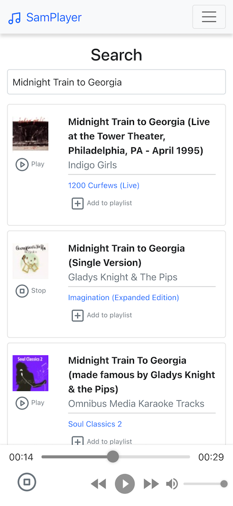

# Samplayer

Samplayer is an example project using [React.js](https://reactjs.org/) and a placeholder 
[Express.js](https://expressjs.com/) API and datastore, which is not called by the frontend. It allows a user to search 
[iTunes Store API](https://affiliate.itunes.apple.com/resources/documentation/itunes-store-web-service-search-api) 
and play 30 second audio samples available free.

This project was timeboxed to about ~7 hours total work from `git init` onward.

##Getting Started
* Ensure you have [NPM](https://docs.npmjs.com/downloading-and-installing-node-js-and-npm) installed on your system,
  (ideally via [NVM](https://github.com/nvm-sh/nvm), because it's great) Samplayer requires NPM 16 or greater.
* Navigate to `/Frontend` and run `npm install` and `npm start`. This project does not include a yarn.lock file and 
so your mileage with Yarn may vary.

The API is not used by the Frontend and just exists as a basic example of a mocked data store one could use to persist 
playlists. It can also be started with `npm install` followed by `npm start`.

##Features

### Complete
* As a user, I can search for an Artist, Song ~~or Playlist~~ and it will appear in a list of results
* As a user, I can play a song from the results list

SamPlayer offers a mobile and desktop responsive music search and play experience, allowing you
to search by song, artist, album, genre or other keyword, see the top 50 results, and play a 30s sample for each.

This sample can be paused and stopped, but otherwise won't close when you leave the player page, allowing you to
take your 30-second groove to other pages.

SamPlayer uses [React Router 6](https://reactrouter.com/docs/en/v6/getting-started/overview) so refreshing a page
won't send you back home (but will reset your search).

SamPlayer is keyboard navigable and uses standard a11y practices like providing textual indicators of status

### Incomplete
* As a user, I can create and save a playlist
* As a user, I can add and remove pieces from the playlist
* As a user, I can play a piece of music from the playlist

## Core Libraries Used

### Server
* [Express.js](https://expressjs.com/) 4

See [package.json](/API/package.json) for version details

### Frontend
* [React.js](https://reactjs.org/) 17 using the base [Create-React-App](https://create-react-app.dev/) template
* [React Router 6](https://reactrouter.com/docs/en/v6/getting-started/overview)
* [Bootstrap 5](https://getbootstrap.com/docs/5.0/getting-started/introduction/) 
  with 
  [React-Bootstrap 2](https://react-bootstrap.github.io/)
* [React Debounce Input](https://www.npmjs.com/package/react-debounce-input)
* [React Feather](https://www.npmjs.com/package/react-feather) for open-source [Feather Icons](https://feathericons.com/)
* [React H5 Audio Player](https://www.npmjs.com/package/react-h5-audio-player)
* [SASS](https://www.npmjs.com/package/sass)

See [package.json](/API/package.json) for version details and minor libraries.

## Defects

## Future Designs